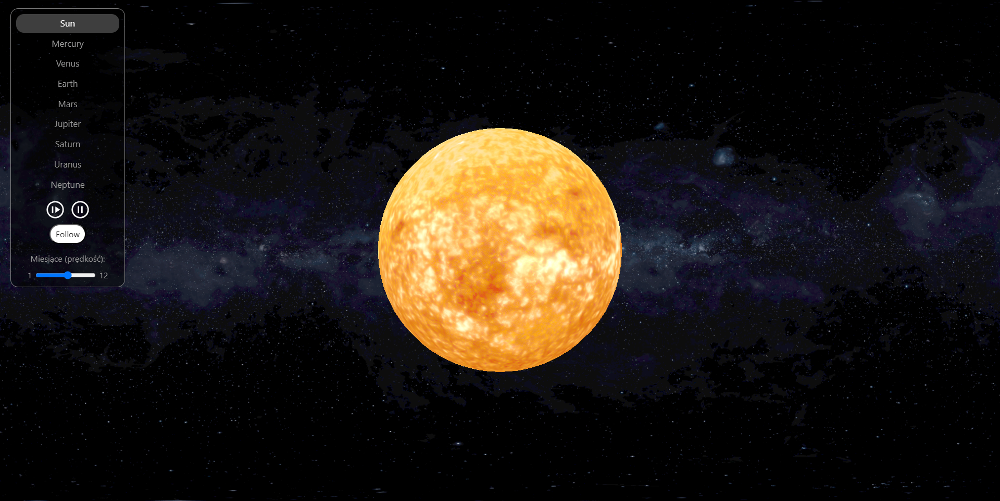

# Solar_System

Solar System created in three.js

## About Solar_System

Upon entering the website, we have access to a planet panel with the following features:

• Selection of planets

• Starting and stopping the movement of planets

• Controlling the speed of planet movement in months.

created by: <b>Samessprog</b> and <b>ThunderStorm24</b>
