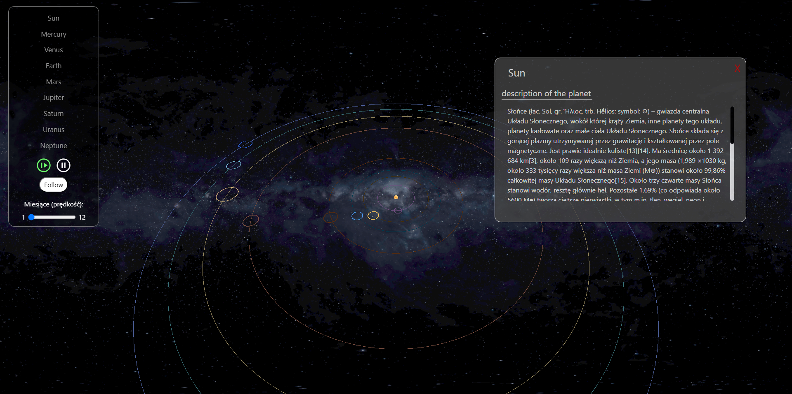

# Solar_System

Solar System created in three.js

The project enables interactive navigation through the solar system using a camera. Users can freely move around and track the motion of planets orbiting the Sun. With special options, they can also change the speed of planetary motion, simulating orbits around the Sun ranging from one to twelve months. They can zoom in and out on planets to see their details up close and learn about their appearances.

One of the most intriguing aspects of our project is the implementation of realistic solar lighting, accurately representing the brightness and darkness experienced on each planet. This allows users to perceive the differences between planets with diverse surfaces, atmospheres, and compositions.

Furthermore, we have incorporated educational elements into our visualization. For each planet, there is accompanying information and interesting facts about its characteristics, such as size, mass, atmospheric composition, number of moons, and fascinating scientific details related to the specific object.

## To run the application

In the **SolarSystem_three.js** directory, you can run:

### `npx vite`

This command will start the solar system.\
Open [http://localhost:5173](http://localhost:5173) to view the solar system in action.

## About Solar_System

Upon entering the website, we have access to a planet panel with the following features:

• Selection of planets

• Starting and stopping the movement of planets

• Controlling the speed of planet movement in months.

At the beginning, the user notices buttons representing each planet in the solar system. By clicking on one of the buttons, they select a planet they want to focus on. Upon making a selection, the camera automatically directs the view towards the chosen planet, allowing them to observe it from different perspectives. If they want to change the planet and view another one, as soon as they press another planet button, the camera adjusts the view to the newly selected planet, and they can examine it up close from various angles. This way, the user can freely explore or learn about the available planets in the solar system. Upon pressing a particular planet, a window appears with a description of the planet, interesting facts, and information about its characteristics, such as size, mass, atmospheric composition, number of moons, and many other fascinating details. This allows the user to closely examine the planet and analyze it along with the accompanying description presented beside it.

When the user wants to observe the motion of the planets, they simply need to press the "Start" button located in the planet panel. If they wish to adjust the speed of the planetary motion, the control panel offers an option to regulate the speed. They can accelerate or decelerate the pace of the planet orbits, customizing the speed according to their preferences.

Upon pressing the button, the planets will start moving at the selected speed set by the user. Additionally, there is a "Follow" button that allows tracking a chosen planet. The camera will automatically start following the movement of the selected planet and remain locked onto it. By pressing the "Follow" button again, the camera will unlock and allow further exploration of the solar system.

If the user wants to stop tracking the movement of a planet, whether for a momentary distraction or intentional analysis, they can click the "Stop" button at any time on the control panel.

To gain full control over the camera view, the user needs to focus on mouse interaction. Moving the cursor with the left mouse button pressed will enable them to rotate the camera around the solar system, allowing them to admire the planetary panorama from different angles. Furthermore, to focus on specific planets and view them up close, they can use the mouse scroll wheel. Scrolling up will zoom in on the image, allowing for a detailed examination of individual planet features. Conversely, scrolling down will zoom out, providing a broader view of the solar system.

These interactive visualization features can be used to deepen one's knowledge about our solar system, uncover the mysteries of planets, and enjoy the splendid visual experiences provided by our project using Three.js.

## Authors

created by: <b>Samessprog</b> and <b>ThunderStorm24</b>
